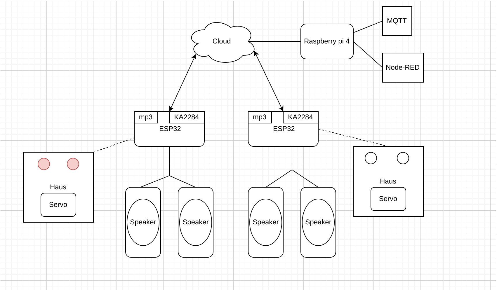
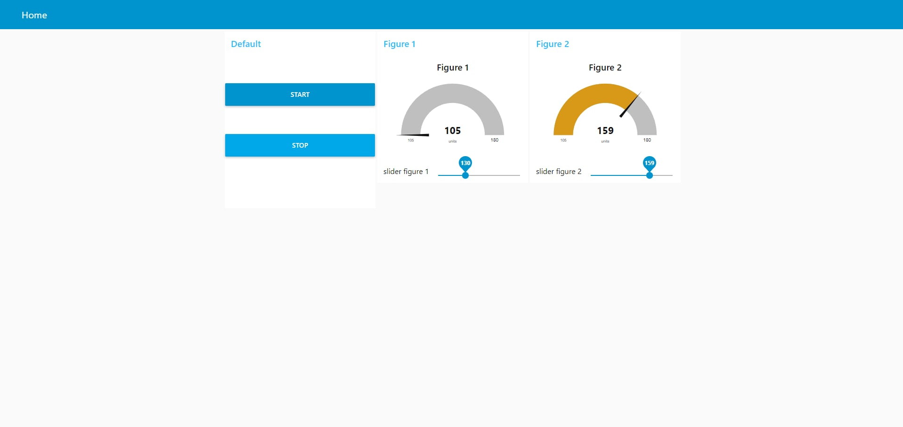
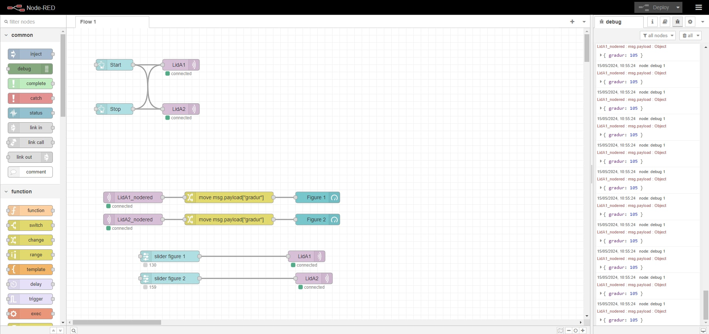

# VESM_VERK5

Loka verkefni í Verksmiðju 2024.

# Það sem við erum að gera er interactive marco polo.

Við erum að nota 2 ESP32-SW fyrir þetta.

Ef ein hauskúpan segir t.d. "Marco" þá sendir hann "Marco" til hins hauskaupans og hinn hauskaupinn svarar "Polo" og svo koll af kolli.

en ef ein hauskúpan segir eitthvað og hin segir ekki neitt þá hættir þetta þar sem þetta er interactive og það þarf að svara.

### Myndband

https://www.youtube.com/shorts/aN9nFoOeGXg

## Hérna er rough overview hvernig allt virkar! 

     

     

     

# Þetta er bara documentation fyrir progression af verkefninu.

    
Þetta er Q1 af verkefninu uppsetning á hauskúpu og tenginum.

    

    

    

    

    

    
Þetta er Q2 af verkefninu uppsetning á hauskúpu og tenginum.

    <h4>Assembly time</h4>
    

    

## Languages Used

| Programming lang | Logo |
|:----:|:----:|
| This project was entirely made with Python. |  |

    

    
Þetta verkefni var unnið af <strong>Anton Smára</strong>, <strong>Lukas Grig</strong>, <strong>Ngozi Miracle</strong> og <strong>Sigurpáll B</strong>.

